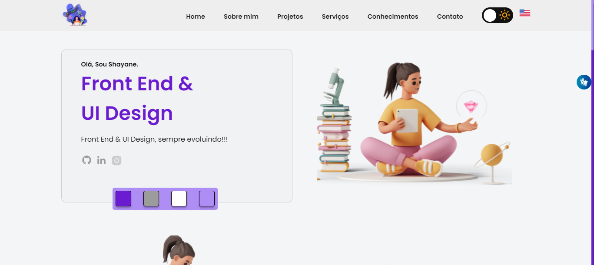

<h1 align="center">

Meu Portfólio - @byte__dev

</h1>

<h4 align="center"><a href="https://shateixeira.github.io">Clique para visitar o site</a></h4>

## 📚 Seções

O site é composto por 5 seções diferentes:

- _Home:_ **Breve apresentação**;
- _Sobre mim:_ **Descrição de quem eu sou**;
- _Projetos:_ **Alguns projetos que desenvolvi e um link para o repositorio do GitHub**;
- _Serviços:_ **Meus conhecimentos em algumas linguagens**.
- _Contato:_ **Faça contato comigo**.

## 💼 Tecnologias

Para desenvolver este site foi utilizado:

- [HTML](https://developer.mozilla.org/pt-BR/docs/Web/HTML)
- [CSS](https://developer.mozilla.org/pt-BR/docs/Web/CSS)
- [JavaScript](https://developer.mozilla.org/pt-BR/docs/Web/JAVASCRIPT)

Utilitários

- [ScrollReveal](https://scrollrevealjs.org/)

## 💼 Licença

Você pode consultar a [LICENSE](./LICENSE) neste link.

---

💜 by Shayane Teixeira
